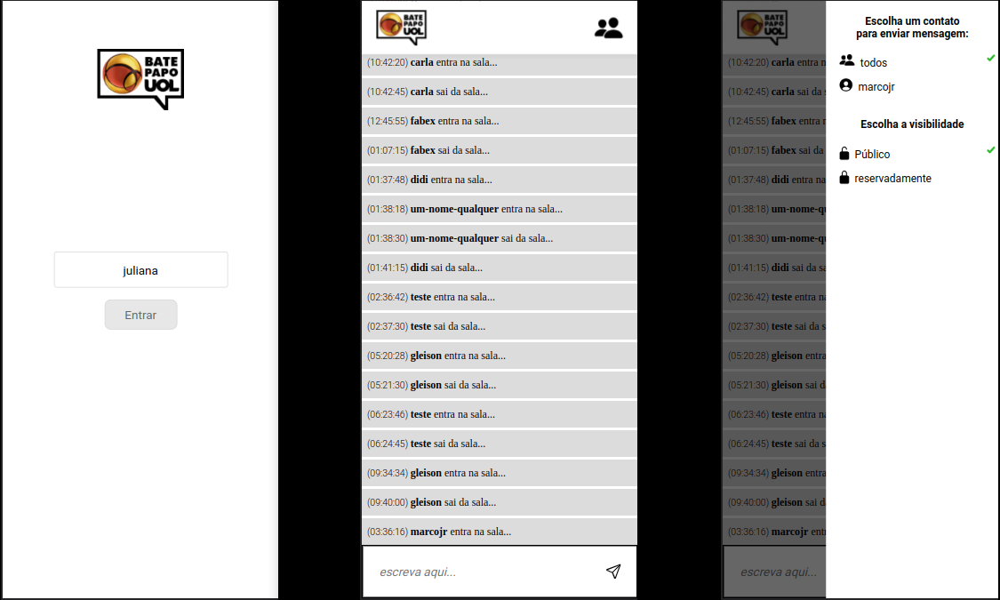

# Bate Papo UOL

<p align="center">
   
</p>


- Este projeto é uma cópia do site de mensagens batepapo-uol
- Você digita seu nome e entra em um chat para poder papear
- Você pode enviar mensagens públicas ou privadas

- [Veja meu deploy no github pages aqui](https://marcojr73.github.io/projeto5-batepapo-uol/)

***

# Demonstração

<p align="center">
   
</p>

## Como usar

Instale meu projeto e abra-o no navegador

```bash
  git clone git@github.com:marcojr73/projeto5-batepapo-uol.git
```

***

##	 Tecnologias e Conceitos

- HTML
- CSS
- Display responsivo para Pc e mobile
- JavaScript
- Consumo de API

***
    
